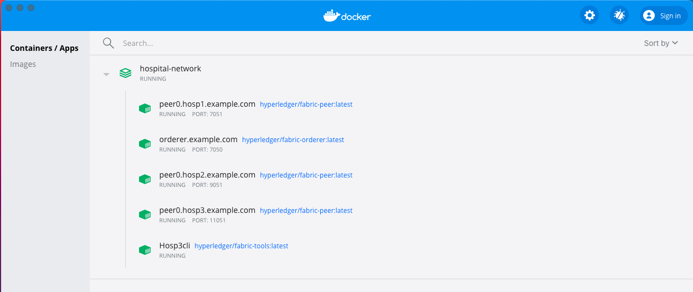
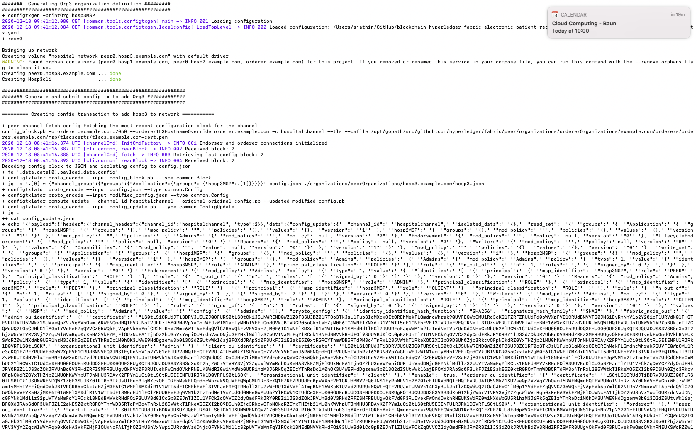

## Running the first office network

Before you can deploy the office network, you need to follow the instructions to [Install the Samples, Binaries and Docker Images](https://hyperledger-fabric.readthedocs.io/en/latest/install.html) in the Hyperledger Fabric documentation.

1. Execute `./network.sh up`.

   - The above command will create two Organization Office 1 and Office 2. With one orderer and consortium created. Certificates are generated by cryptogen.

     

2. Execute `./network.sh createChannel -c officechannel`

   - A channel is created. Default name of channel is officechannel.

   

3. Execute `cd addOffice3`.
4. Execute `./addOffice3.sh up`

   - The command creates Office 3 and adds the organization to the officechannel channnel.

   

   

5. To deploy the employee chaincode on officechannel,

   - First up the network with couchdb using command - `./network.sh up createChannel -c officechannel -s couchdb`
   - Deploy chaincode employee `./network.sh deployCC -c officechannel -ccn employee -ccv 1 -cci initLedger`
   - Then Execute following commands -
     export PATH=${PWD}/../bin:$PATH
     export FABRIC_CFG_PATH=$PWD/../config/
	export CORE_PEER_TLS_ENABLED=true
	export CORE_PEER_LOCALMSPID="office1MSP"
	export CORE_PEER_TLS_ROOTCERT_FILE=${PWD}/organizations/peerOrganizations/office1.lithium.com/peers/peer0.office1.lithium.com/tls/ca.crt
     export CORE_PEER_MSPCONFIGPATH=${PWD}/organizations/peerOrganizations/office1.lithium.com/users/Admin@office1.lithium.com/msp
     export CORE_PEER_ADDRESS=localhost:7051
   - If initLedger argument is added in deployCC command, then ignore the following command. If not, execute this statement
     peer chaincode invoke -o localhost:7050 --ordererTLSHostnameOverride orderer.lithium.com --tls --cafile ${PWD}/organizations/ordererOrganizations/lithium.com/orderers/orderer.lithium.com/msp/tlscacerts/tlsca.lithium.com-cert.pem -C officechannel -n employee --peerAddresses localhost:7051 --tlsRootCertFiles ${PWD}/organizations/peerOrganizations/office1.lithium.com/peers/peer0.office1.lithium.com/tls/ca.crt --peerAddresses localhost:9051 --tlsRootCertFiles ${PWD}/organizations/peerOrganizations/office2.lithium.com/peers/peer0.office2.lithium.com/tls/ca.crt --peerAddresses localhost:11051 --tlsRootCertFiles ${PWD}/organizations/peerOrganizations/office3.lithium.com/peers/peer0.office3.lithium.com/tls/ca.crt -c '{"function":"initLedger","Args":[]}'

6. Sample query - peer chaincode query -C officechannel -n employee -c '{"Args":["reademployee","employee1"]}'
7. To bring the network down
   - `./addOffice3 down`

## Troubleshooting

If errors like orderer keeps shutting down or a message like
`!!!!!!!!!!!!!!! Fetching config block from orderer has Failed !!!!!!!!!!!!!!!!`. A initial research as of now is the docker image has been damaged.

So execute the following command
`docker stop $(docker ps -a -q)  ; docker rm -f $(docker ps -aq) ; docker system prune -a ; docker volume prune ; docker ps -a ; docker images -a ; docker volume ls`
WARNING: THIS WILL DELETE ALL DOCKER IMAGES, CACHES AND CONTAINERS

Once yo have executed the above command, install just the Docker images again. And execute the network scripts.
